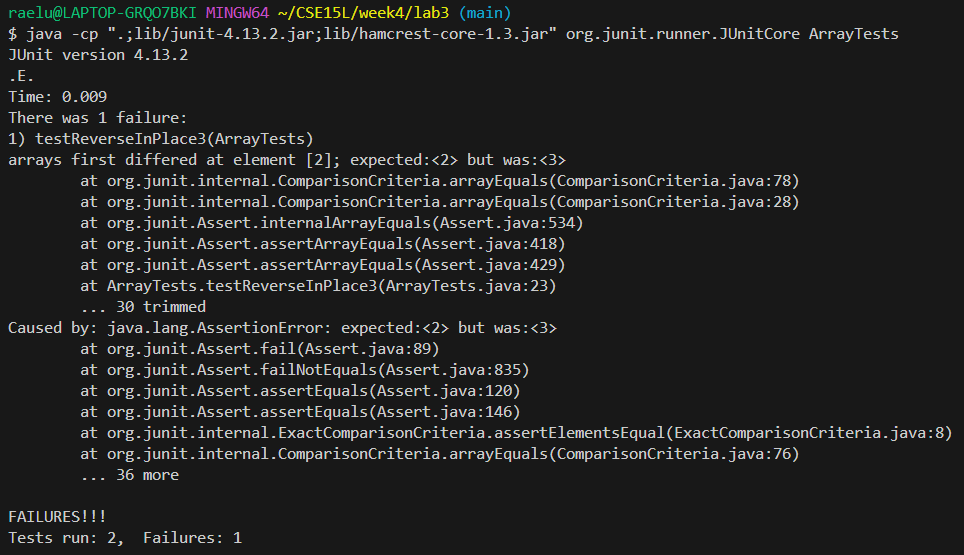

I chose the testReverseInPlace method bug.

This is a failure inducing input:  
```
  @Test 
	public void testReverseInPlace3() {
    int[] input1 = { 1,2,3,4 };
    ArrayExamples.reverseInPlace(input1);
    assertArrayEquals(new int[]{ 4,3,2,1 }, input1);
	}
```  
This is a non-failure inducing input:  
```
	@Test 
	public void testReverseInPlace() {
    int[] input1 = { 3 };
    ArrayExamples.reverseInPlace(input1);
    assertArrayEquals(new int[]{ 3 }, input1);
	}
```

Symptom:
  
  
Old code:
```
  static void reverseInPlace(int[] arr) {
    for(int i = 0; i < arr.length; i += 1) {
      arr[i] = arr[arr.length - i - 1];
    }
  }
```

New code:
```
  static void reverseInPlace(int[] arr) {
    int temp = 0;
    for(int i = 0; i < (arr.length/2); ++i) {
      temp = arr[i];
      arr[i] = arr[arr.length - i - 1];
      arr[arr.length - i - 1] = temp;
    }
  }
```  
  
  
The fix addresses the issue because it holds the old values in a temporary variable so that once the arrays values are reversded in the first half, it doesnt copy the new values into the second half. 
This ensures that the desired reversal is executed since we can call back the old values to complete the new array.  


I chose the `find` command.  

One way to use `find` is to find files with a certain type.
```
$ find ~/Downloads/docsearch-main/docsearch-main/technical/911report -type f

/c/Users/raelu/Downloads/docsearch-main/docsearch-main/technical/911report/chapter-1.txt
/c/Users/raelu/Downloads/docsearch-main/docsearch-main/technical/911report/chapter-10.txt
/c/Users/raelu/Downloads/docsearch-main/docsearch-main/technical/911report/chapter-11.txt
/c/Users/raelu/Downloads/docsearch-main/docsearch-main/technical/911report/chapter-12.txt
/c/Users/raelu/Downloads/docsearch-main/docsearch-main/technical/911report/chapter-13.1.txt
/c/Users/raelu/Downloads/docsearch-main/docsearch-main/technical/911report/chapter-13.2.txt
/c/Users/raelu/Downloads/docsearch-main/docsearch-main/technical/911report/chapter-13.3.txt
/c/Users/raelu/Downloads/docsearch-main/docsearch-main/technical/911report/chapter-13.4.txt
/c/Users/raelu/Downloads/docsearch-main/docsearch-main/technical/911report/chapter-13.5.txt
/c/Users/raelu/Downloads/docsearch-main/docsearch-main/technical/911report/chapter-2.txt
/c/Users/raelu/Downloads/docsearch-main/docsearch-main/technical/911report/chapter-3.txt
/c/Users/raelu/Downloads/docsearch-main/docsearch-main/technical/911report/chapter-5.txt
/c/Users/raelu/Downloads/docsearch-main/docsearch-main/technical/911report/chapter-6.txt
/c/Users/raelu/Downloads/docsearch-main/docsearch-main/technical/911report/chapter-7.txt
/c/Users/raelu/Downloads/docsearch-main/docsearch-main/technical/911report/chapter-8.txt
/c/Users/raelu/Downloads/docsearch-main/docsearch-main/technical/911report/chapter-9.txt
/c/Users/raelu/Downloads/docsearch-main/docsearch-main/technical/911report/preface.txt
```
This seaches all the files with type file in the 911report directory. This is helpful if you only want to see the files stored in this specific directory.  
  
```
$ find ~/Downloads/docsearch-main/docsearch-main/technical -type d

/c/Users/raelu/Downloads/docsearch-main/docsearch-main/technical
/c/Users/raelu/Downloads/docsearch-main/docsearch-main/technical/911report
/c/Users/raelu/Downloads/docsearch-main/docsearch-main/technical/biomed
/c/Users/raelu/Downloads/docsearch-main/docsearch-main/technical/government
/c/Users/raelu/Downloads/docsearch-main/docsearch-main/technical/government/About_LSC
/c/Users/raelu/Downloads/docsearch-main/docsearch-main/technical/government/Alcohol_Problems
/c/Users/raelu/Downloads/docsearch-main/docsearch-main/technical/government/Env_Prot_Agen
/c/Users/raelu/Downloads/docsearch-main/docsearch-main/technical/government/Gen_Account_Office
/c/Users/raelu/Downloads/docsearch-main/docsearch-main/technical/government/Media
/c/Users/raelu/Downloads/docsearch-main/docsearch-main/technical/government/Post_Rate_Comm
/c/Users/raelu/Downloads/docsearch-main/docsearch-main/technical/plos
```
This seaches all of the type directory within technical. This is helpful if you want to see what directories (and nothing else) are in this specific directory.  


Another way to use `find` is searching a file by name.  
```
$ find -name "chapter*"

./docsearch-main/technical/911report/chapter-1.txt
./docsearch-main/technical/911report/chapter-10.txt
./docsearch-main/technical/911report/chapter-11.txt
./docsearch-main/technical/911report/chapter-12.txt
./docsearch-main/technical/911report/chapter-13.1.txt
./docsearch-main/technical/911report/chapter-13.2.txt
./docsearch-main/technical/911report/chapter-13.3.txt
./docsearch-main/technical/911report/chapter-13.4.txt
./docsearch-main/technical/911report/chapter-13.5.txt
./docsearch-main/technical/911report/chapter-2.txt
./docsearch-main/technical/911report/chapter-3.txt
./docsearch-main/technical/911report/chapter-5.txt
./docsearch-main/technical/911report/chapter-6.txt
./docsearch-main/technical/911report/chapter-7.txt
./docsearch-main/technical/911report/chapter-8.txt
./docsearch-main/technical/911report/chapter-9.txt
```
I am looking for any file with "chapter" in the name within technical. This is helpful if I only want to see what chapter files there are in technical.  

```
$ find -name "preface*"

./docsearch-main/technical/911report/preface.txt
```
I am looking for any file with "preface" in the name within technical. This is helpful if I want to only see files with "preface" in the name that are within my working directory.  

A third way to use this command is looking for empty files.
```
$ find -type d -empty
```
I didn't find any empty directories. I combine `-empty` with `-type` to specify I am only looking for a directory that is empty.  

```
$ find -type f -empty
```
I didn't find any empty files. I combine `-empty` with `-type` to specify I am only looking for a file that is empty.   

A fourth way you can use it is limiting the amount of files that are returned with the find command.
```
$ find -maxdepth 1 -type d

.
./911report
./biomed
./government
./plos
```
I am looking for a directory, but only want to see directories 1 descent from my working directory (technical). This is helpful when I don't want to see subdirectories within the subdirectories of technical.  

```
$ find -maxdepth 2 -type d

.
./911report
./biomed
./government
./government/About_LSC
./government/Alcohol_Problems
./government/Env_Prot_Agen
./government/Gen_Account_Office
./government/Media
./government/Post_Rate_Comm
./plos
```
I am looking for a directory, but this time I want to see directories 2 descents from my working directory (technical). This is helpful when I only want to see directories at a depth of 2 away from technical.
